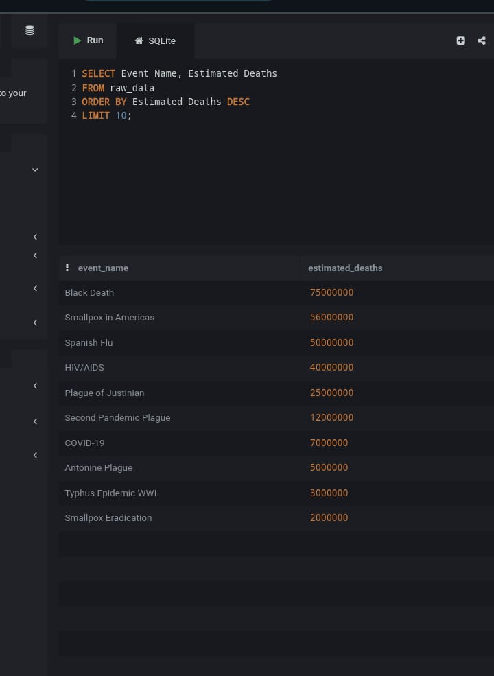
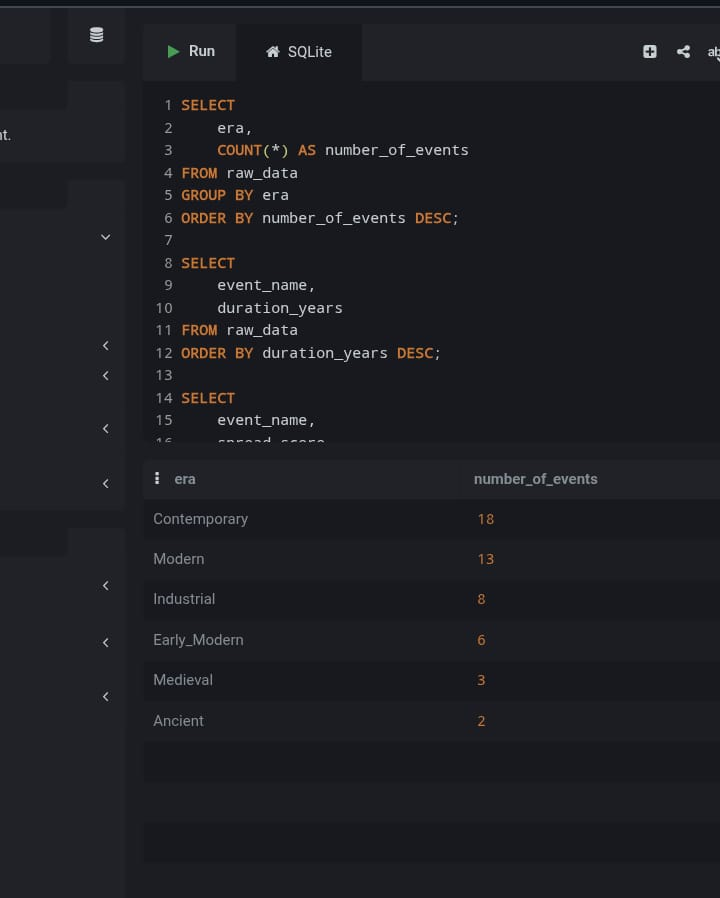
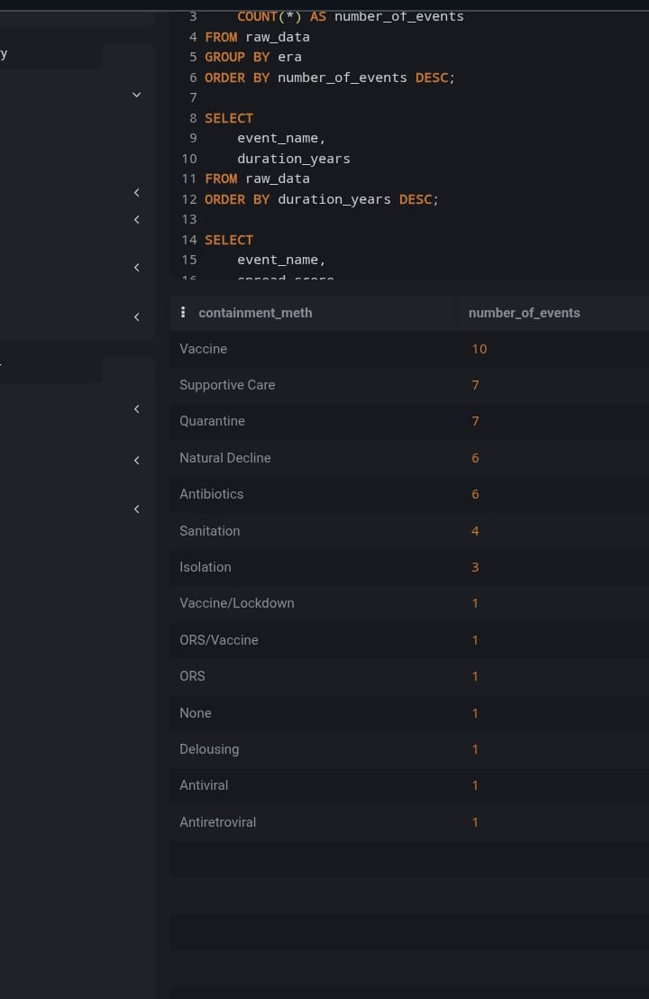
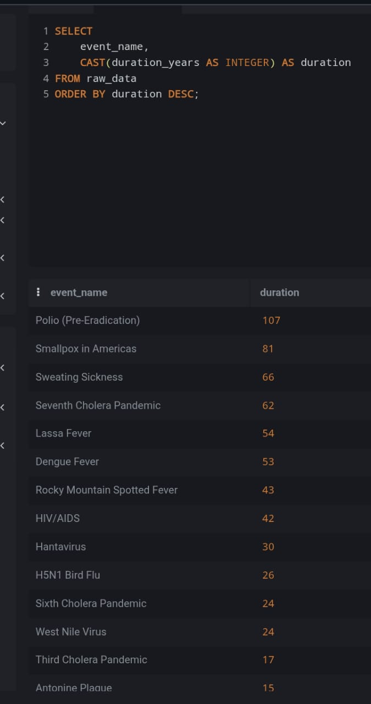
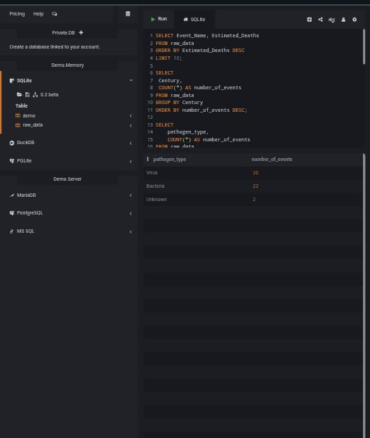
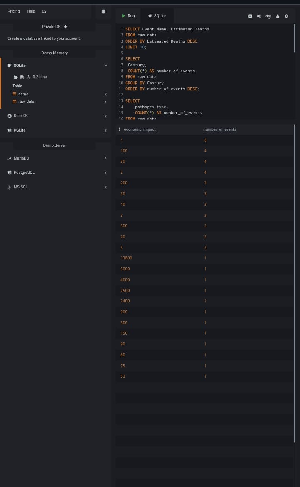
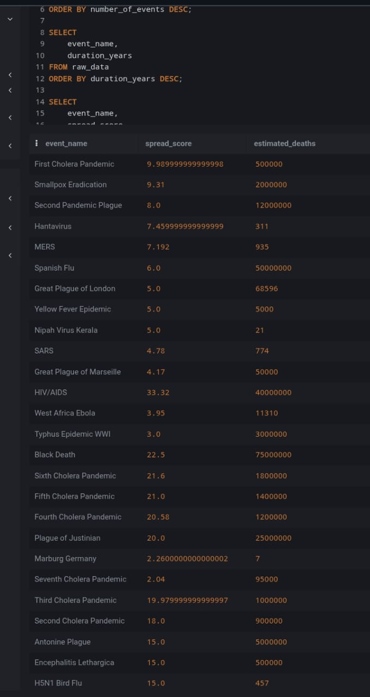
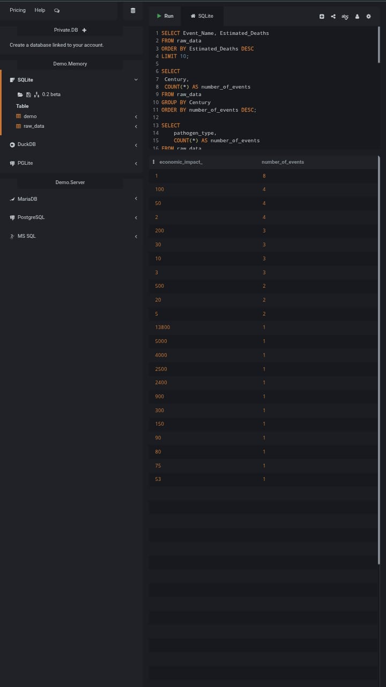
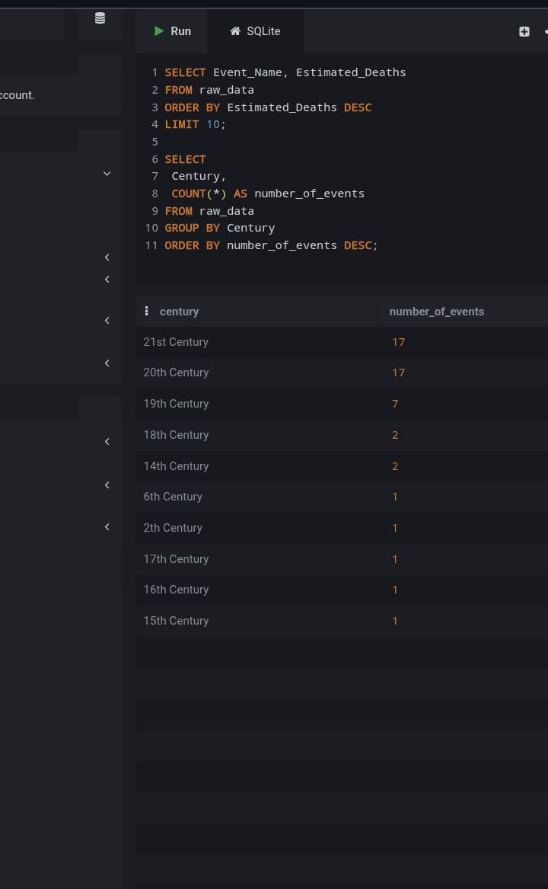
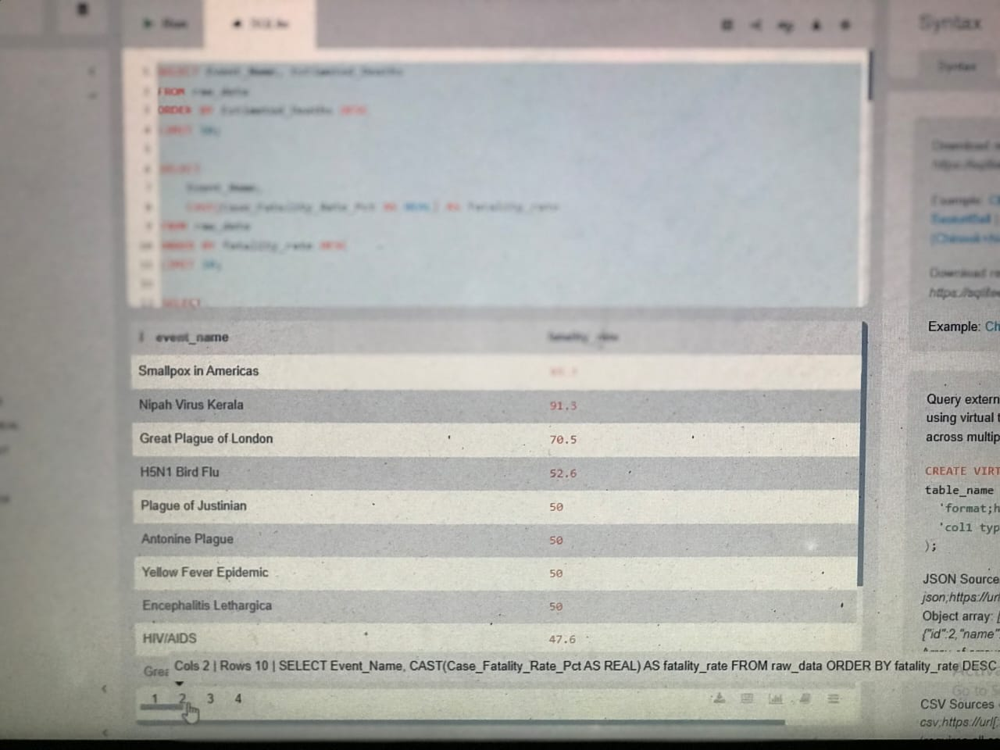

#  Global Pandemic Analysis Using SQLite

##  Project Overview
This project analyzes historical pandemic data using **SQLite** to uncover trends in mortality, transmission, geographic spread, and economic impact.

##  Introduction
Pandemics have shaped human history through their impact on populations, economies, and healthcare systems.

This project explores pandemic data to identify patterns in:
- Fatality rates  
- Transmission methods  
- Geographic distribution  
- Duration and spread  

---

## 📊 About the Dataset
The dataset contains records of major pandemics across different time periods.

### Key Features:
- Event Name  
- Pathogen Type  
- Start & End Year  
- Duration  
- Origin Region  
- Estimated Cases & Deaths  
- Case Fatality Rate  
- Transmission Method  
- Containment Strategy  
- Economic Impact  
- Spread Score  
- Century
- era

 **Dataset Source:**  
https://1drv.ms/x/c/f729756d9dbf5534/IQDytaZSbLKLTbvg7lv35gGOAUDDTbw6Lr7UV4koQ7yAY8Y?e=s1XS3B

---

##  Problem Statement
Despite the availability of pandemic data, it is often not fully utilized to generate actionable insights.

This project answers key questions such as:
- Which pandemics were the most deadly?  
- What pathogen types are most common?  
- How do transmission methods influence spread?  
- Which regions are most affected?  
- What factors drive fatality rates?  

---

##  Objectives
- Analyze pandemic severity using mortality data  
- Identify dominant pathogen types  
- Examine transmission and containment patterns  
- Explore geographic and time-based trends  

---

##  Tools & Technologies
- SQLite  
- DB Browser for SQLite  
- Excel / CSV  
- GitHub  

---

## 🧹 Data Cleaning & Preparation
- Imported CSV dataset into SQLite  
- Resolved column naming inconsistencies  
- Renamed truncated columns  
- Converted numeric values using SQL functions  
- Ensured data consistency for analysis

  ---

##  Visualization (Dashboard)
The project uses a **tabular dashboard (SQLite table screenshot)** to display:

- Structured pandemic records  
- Cleaned dataset columns  
- Organized data for querying  

---

##  SQL Analysis
SQL queries used in this project are stored in:

 **`queries.sql`**

The queries cover:
- Deadliest pandemics  
- Fatality rate analysis  
- Transmission patterns  
- Geographic distribution  
- Economic impact  
- Time-based analysis  

---

##  Key Insights
- Certain pandemics recorded extremely high fatality rates  
- Viral diseases are the most common cause of pandemics  
- Airborne transmission contributes to rapid spread  
- Some regions appear repeatedly as outbreak origins  
- High spread does not always result in high mortality  
- Duration does not always determine severity  

---

##  Recommendations
- Strengthen early detection systems  
- Focus on high-risk transmission methods  
- Improve global health collaboration  
- Invest in healthcare infrastructure  
- Maintain clean and structured data for analysis  

---

## Conclusion
This project demonstrates how SQL can be used to extract meaningful insights from real-world datasets.

Understanding pandemic patterns can support better preparedness and response strategies.

---

## Future Improvements
- Add data visualizations (charts)  
- Build an interactive dashboard  
- Expand dataset with recent data  
- Integrate advanced analytics  

---
##  Author
-Ukatta Chinasa Rachael
